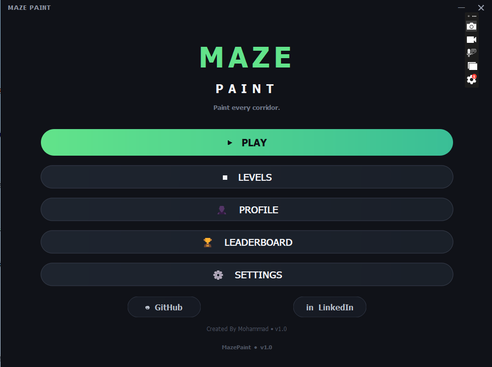
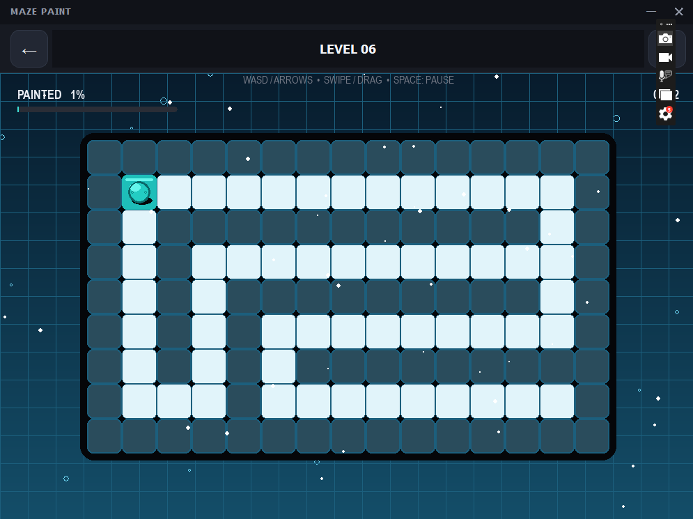
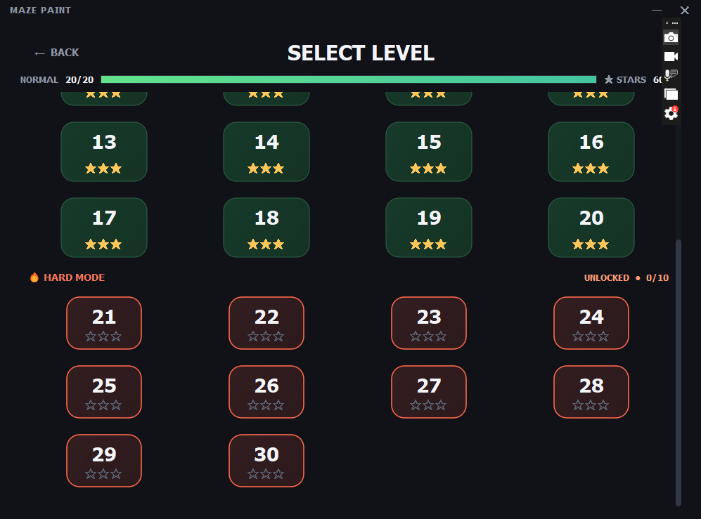
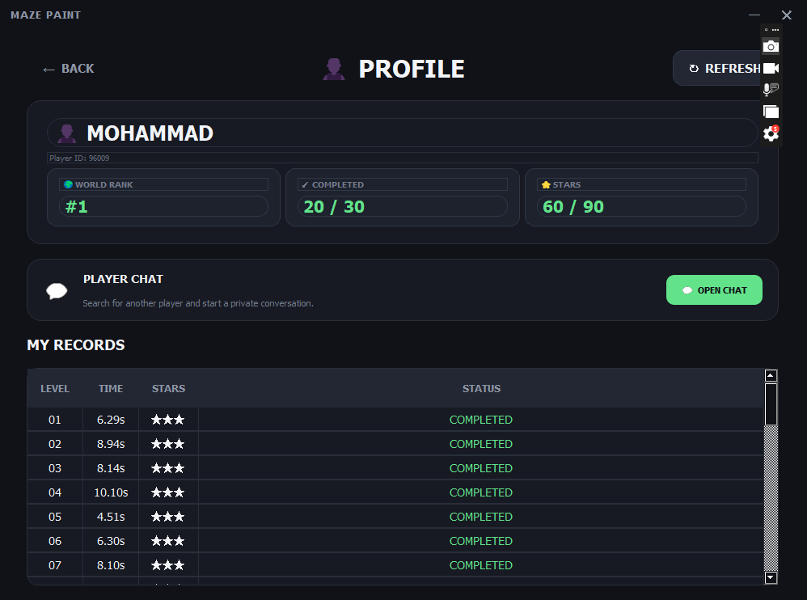
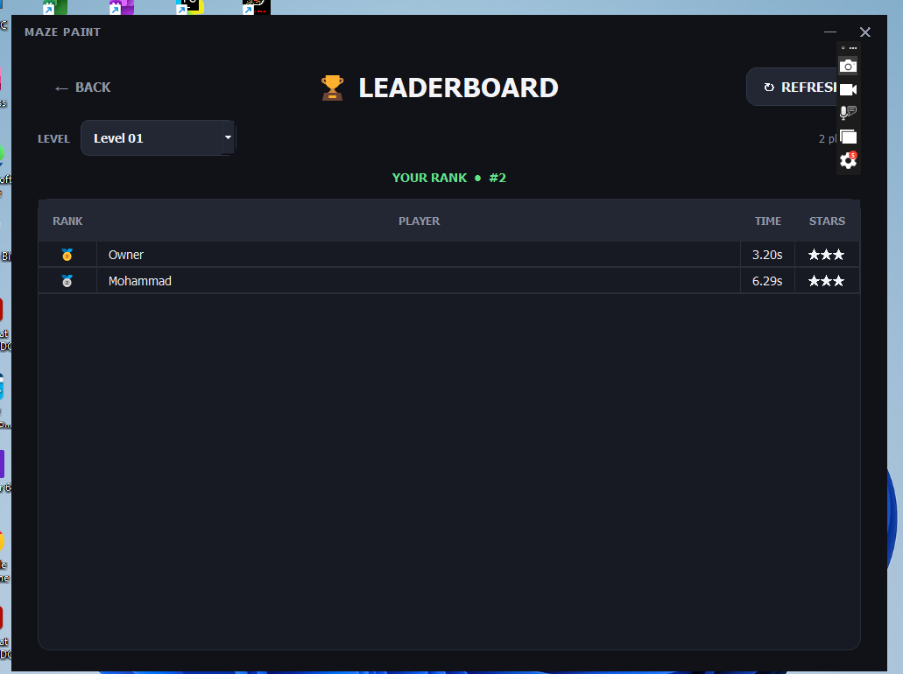
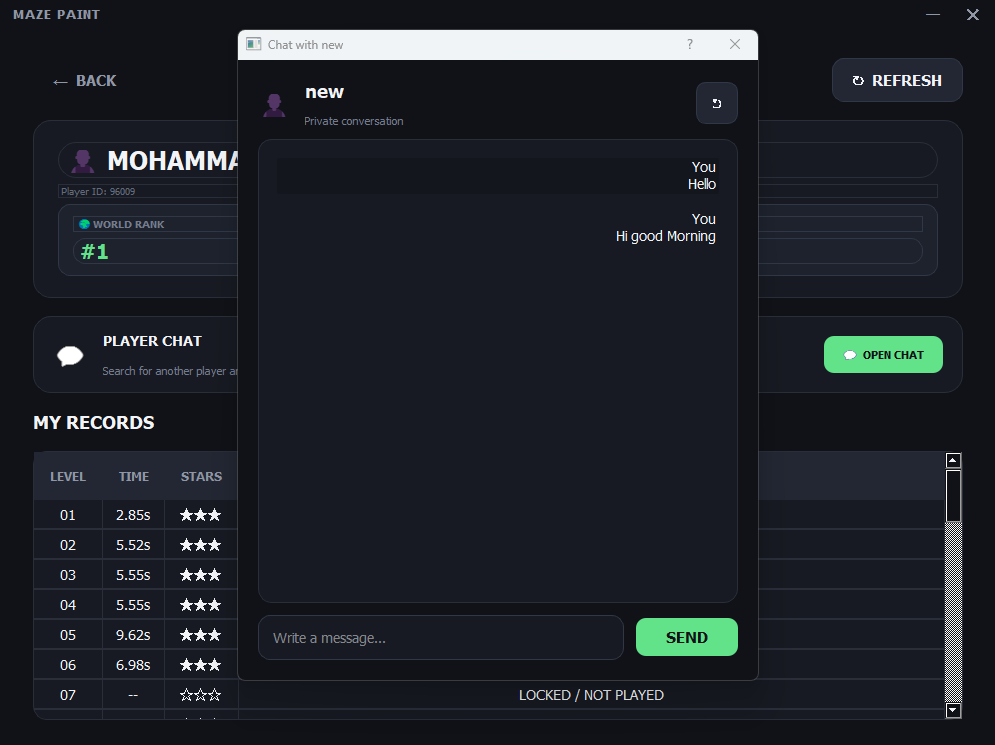

# 🎨 MazePaint Online Game😎


> **Explore the maze. Solve the puzzle. Become the champion.**

MazePaint is a modern 2D maze adventure game built with **Python, PyQt5 and Pygame**.

The project combines a polished desktop interface with an interactive maze game, level progression, player profiles, save data, scoring, stars, leaderboards and online features.

---

# 📚 Contents

<!--ts-->
[📥 Downloads](#downloads)
- [✨ Features](#-features)
- [🛠️ Built With](#️-built-with)
- [🖼️ Screenshots & GIF](#️-screenshots--gif)
- [🚀 Installation](#-installation)
- [🎮 Controls](#-controls)
- [🌐 Online Features](#online)
- [📁 Project Structure](#-project-structure)
- [🗺️ Roadmap](#️-roadmap)
- [🤝 Contributing](#-contributing)
- [📄 License](#-license)
<!--te-->
## 🎮 Game Preview


<p align="center">
  
  
  
  
  
  


</p>
<p align="center">
  <i>More gameplay screenshots and videos coming soon.</i>
</p>

---
<a id="downloads"></a>

## 📥 Downloads
[⬇️ Windows](https://github.com/imfallah/Maze-Paint_Game/releases)

[⬇️ Linux](https://github.com/imfallah/Maze-Paint_Game/releases)


## ✨ Features

### 🧩 Gameplay

* 🎮 Interactive 2D maze gameplay
* 🗺️ Multiple handcrafted levels
* 🔓 Progressive level unlocking
* ⭐ Star-based level scoring
* 🏆 Completion tracking
* 👑 Special boss level
* 🌦️ Dynamic environmental effects
* 🌀 Special movement and visual effects

### 👤 Player System

* Player profiles
* Custom player names
* Local progress saving
* Level unlock tracking
* Completed-level tracking
* Star records
* Separate player data for multiple game instances

### 🌐 Online Features

* 🏆 Online leaderboard
* 🟢 Player online presence
* 💬 Player-to-player messaging
* ☁️ Supabase-powered online services
* 🔄 Real-time-ready online architecture

### 🎨 User Interface

* Modern dark-themed interface
* Custom title bar
* Rounded animated buttons
* Hover animations
* Profile interface
* Settings interface
* Leaderboard interface
* Integrated Pygame game window
* Dedicated splash screen

---

## 🛠️ Built With

| Technology     | Purpose                   |
| -------------- | ------------------------- |
| 🐍 Python      | Core programming language |
| 🎨 PyQt5       | Desktop user interface    |
| 🎮 Pygame      | Game engine and rendering |
| 📄 JSON        | Level and local save data |
| ☁️ Supabase    | Online services           |
| 📦 PyInstaller | Application packaging     |

---

## 🏗️ Project Architecture

MazePaint combines a **PyQt5 desktop application** with a **Pygame game engine**.

```text
                    ┌─────────────────────┐
                    │      MazePaint      │
                    │      main.py        │
                    └──────────┬──────────┘
                               │
              ┌────────────────┴────────────────┐
              │                                 │
      ┌───────▼────────┐               ┌────────▼────────┐
      │    PyQt5 UI    │               │ Pygame Engine   │
      │                │               │                 │
      │ Main Menu      │               │ Maze            │
      │ Profile        │               │ Player          │
      │ Settings       │               │ Levels          │
      │ Leaderboard    │               │ Gameplay        │
      └───────┬────────┘               └────────┬────────┘
              │                                 │
              └────────────────┬────────────────┘
                               │
                     ┌─────────▼─────────┐
                     │   Data & Services │
                     │                   │
                     │ JSON Save System  │
                     │ Level Manager     │
                     │ Supabase API      │
                     └───────────────────┘
```

---


## 📁 Project Structure

```text
MazePaint/
│
├── assets/
│   ├── icons/
│   ├── images/
│   └── ...
│
├── game/
│   ├── game.py
│   ├── maze.py
│   ├── player.py
│   ├── level_manager.py
│   ├── leaderboard_api.py
│   ├── pygame_widget.py
│   ├── save_manager.py
│   └── ...
│
├── levels/
│   ├── level_01.json
│   ├── level_02.json
│   ├── level_03.json
│   └── ...
│
├── main.py
├── splash_screen.py
├── MazePaint.spec
├── requirements.txt
└── README.md
```

---

## 🗺️ Level System

MazePaint uses JSON-based level definitions, making it easy to create and modify levels without changing the core game code.

### Difficulty Progression

```text
┌─────────────────────────────────────┐
│  LEVEL 01 - 05   🟢 EASY            │
├─────────────────────────────────────┤
│  LEVEL 06 - 10   🟡 MEDIUM          │
├─────────────────────────────────────┤
│  LEVEL 11 - 15   🟠 HARD            │
├─────────────────────────────────────┤
│  LEVEL 16 - 19   🔴 VERY HARD       │
├─────────────────────────────────────┤
│  LEVEL 20        👑 BOSS            │
└─────────────────────────────────────┘
```

Each level can contain its own maze layout, gameplay configuration and completion requirements.

---

## ⭐ Star System

Players can earn stars by completing levels efficiently.

```text
⭐        Completed
⭐⭐      Good performance
⭐⭐⭐    Excellent performance
```

Stars are stored locally and can be used to track player performance across the game.

---

## 💾 Save System

MazePaint automatically stores player progress locally.

Typical saved data includes:

```json
{
    "unlocked": 1,
    "completed": [],
    "stars": {}
}
```

Player-specific data can also be separated using the MazePaint instance system.

For example:

```bash
MAZEPAINT_INSTANCE=player1
```

This allows multiple local game instances to maintain separate player information.

---
<a id="online"></a>

## 🌐 Online Features

MazePaint can communicate with online services through **Supabase**.

```text
                 MazePaint
                     │
                     ▼
              Leaderboard API
                     │
                     ▼
                 Supabase
              ┌──────┼──────┐
              │      │      │
              ▼      ▼      ▼
         Leaderboard Chat  Presence
```

Online functionality includes:

* Leaderboard
* Player presence
* Chat messages
* Online player information

> Online services require the appropriate Supabase configuration.

---

## 🎮 Controls

| Key       | Action         |
| --------- | -------------- |
| `W` / `↑` | Move Up        |
| `S` / `↓` | Move Down      |
| `A` / `←` | Move Left      |
| `D` / `→` | Move Right     |
| `ESC`     | Pause / Return |

> Controls may be expanded as new gameplay mechanics are added.

---

## 🚀 Run From Source

### 1. Clone the repository

```bash
git clone https://github.com/imfallah/Maze-Paint_Game.git
cd Maze-Paint_Game
```

### 2. Create a virtual environment

#### Windows

```bash
python -m venv .venv
.venv\Scripts\activate
```

#### Linux

```bash
python3 -m venv .venv
source .venv/bin/activate
```

### 3. Install dependencies

```bash
pip install -r requirements.txt
```

### 4. Run MazePaint

```bash
python main.py
```

---

## 🪟 Windows Build

MazePaint can be packaged as a standalone Windows application using **PyInstaller**.

```bash
pyinstaller MazePaint.spec
```

The generated application will be placed inside:

```text
dist/
```

The packaged version includes the required game assets and level files.

---

## 🐧 Linux

MazePaint can also be built and executed on Linux.

Run directly from source:

```bash
python3 main.py
```

Or build a standalone application:

```bash
pyinstaller MazePaint.spec
```

Linux distribution packages can be provided through the project's GitHub Releases.

---

## 📦 Releases

Official builds will be published through GitHub Releases.

**Windows**

```text
MazePaint.exe
```

**Linux**

```text
MazePaint
```

Additional packages such as `.deb` or AppImage may be provided in future releases.

---

## ⚙️ Configuration

Online features can be configured through environment variables.

Example:

```bash
SUPABASE_URL=your_supabase_url
SUPABASE_KEY=your_supabase_key
```

> Never commit private API keys or secrets to the repository.

---

## 🔧 Development

Clone the repository and create a development environment:

```bash
git clone https://github.com/imfallah/Maze-Paint_Game.git
cd Maze-Paint_Game

python -m venv .venv
```

Activate the environment and install the development dependencies:

```bash
pip install -r requirements.txt
```

Then run:

```bash
python main.py
```

---

## 🗺️ Roadmap

### Completed

* [x] Core maze gameplay
* [x] PyQt5 interface
* [x] Pygame integration
* [x] Level management
* [x] Local save system
* [x] Player profiles
* [x] Star system
* [x] Leaderboard system
* [x] Online presence
* [x] Chat architecture
* [x] Windows packaging
* [x] Linux build support

### Planned

* [ ] More maze levels
* [ ] Improved multiplayer features
* [ ] Achievements system
* [ ] Sound effects
* [ ] Background music
* [ ] More weather effects
* [ ] Advanced player statistics
* [ ] Improved online synchronization
* [ ] More polished animations
* [ ] Steam / game-store distribution

---

## 🐛 Known Issues

MazePaint is an actively developed project.

Some online features and environmental effects may still be under development and can change between releases.

If you find a bug, please open an issue on GitHub.

---

## 🤝 Contributing

Contributions are welcome!

If you would like to improve MazePaint:

1. Fork the repository
2. Create a new branch

```bash
git checkout -b feature/my-feature
```

3. Make your changes
4. Commit your changes

```bash
git commit -m "Add new feature"
```

5. Push your branch

```bash
git push origin feature/my-feature
```

6. Open a Pull Request

---

## 📄 License

This project is currently under active development.

A formal open-source license will be added before the first stable public release.

---

## 👨‍💻 Author

### Mohammad Fallahnejad

Python Developer • Game Developer • Linux Enthusiast

GitHub:

**https://github.com/imfallah**

---

## ⭐ Support the Project

If you like MazePaint, consider giving the repository a ⭐ on GitHub.

Your support helps the project grow!

---

<p align="center">

### 🎨 MazePaint

**Explore. Solve. Paint. Compete.**

Made with ❤️ using Python, PyQt5 and Pygame.

</p>
